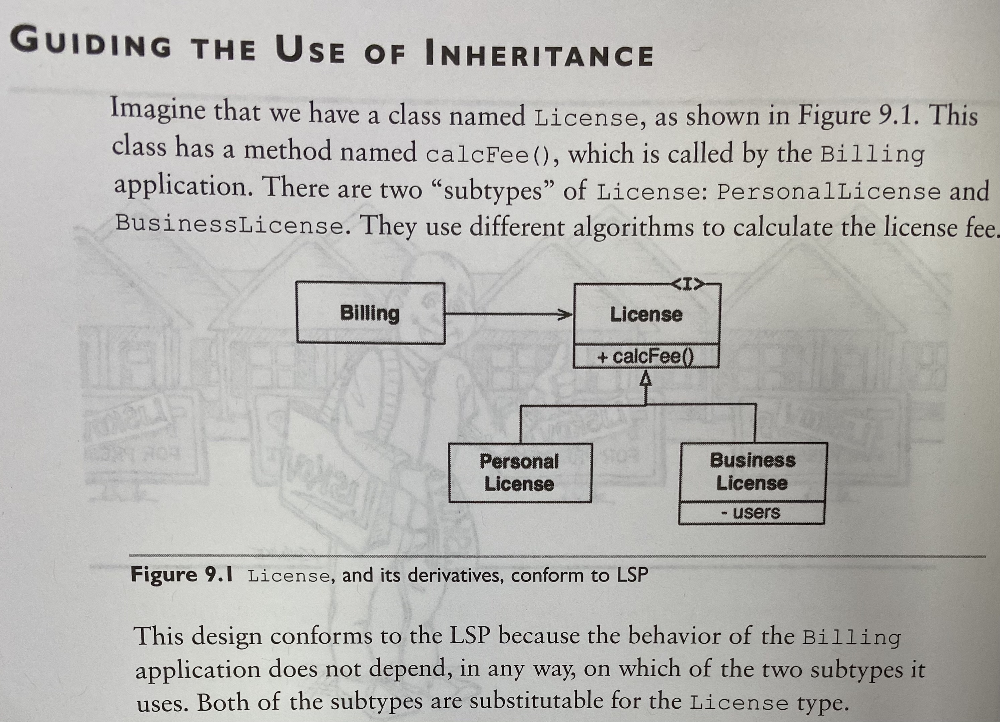
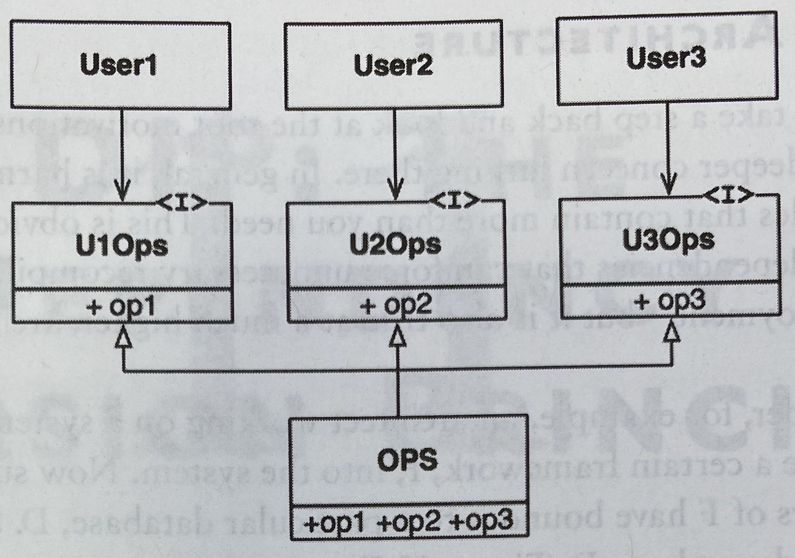
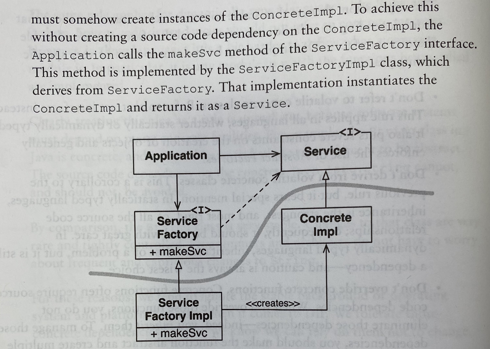
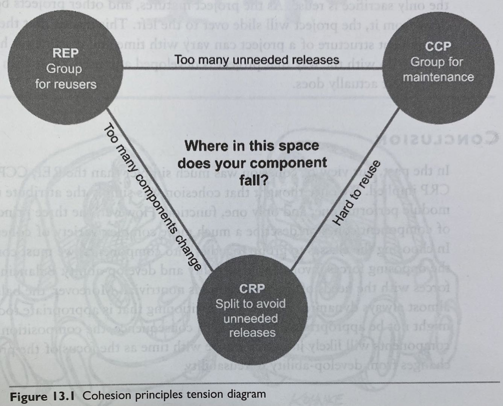
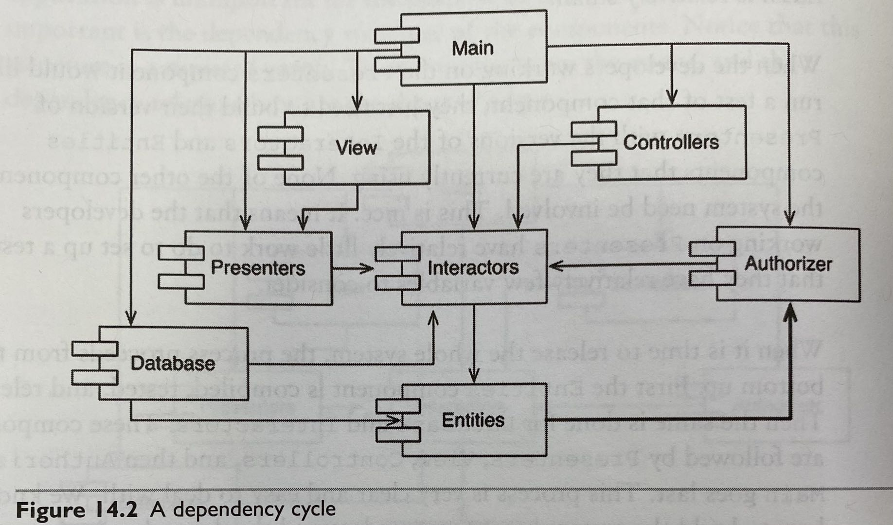
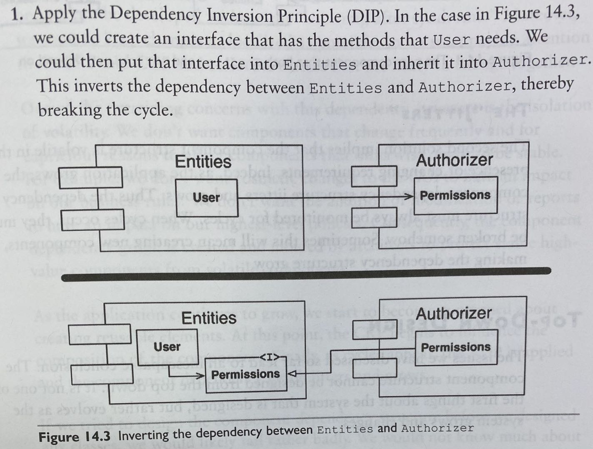
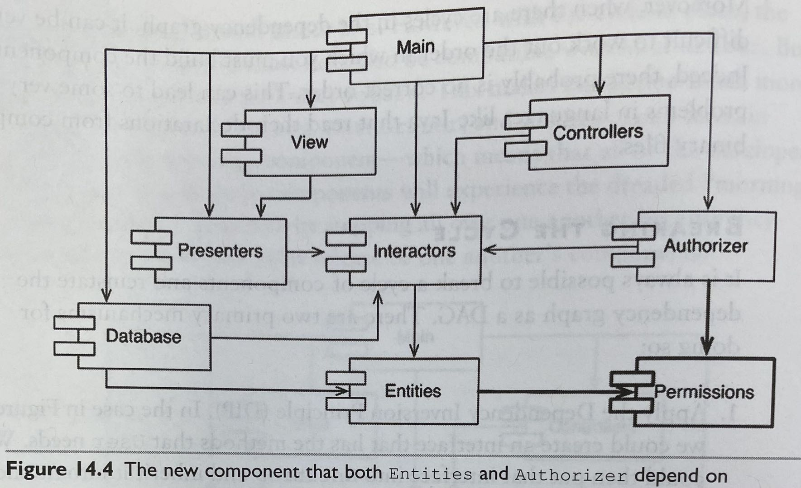
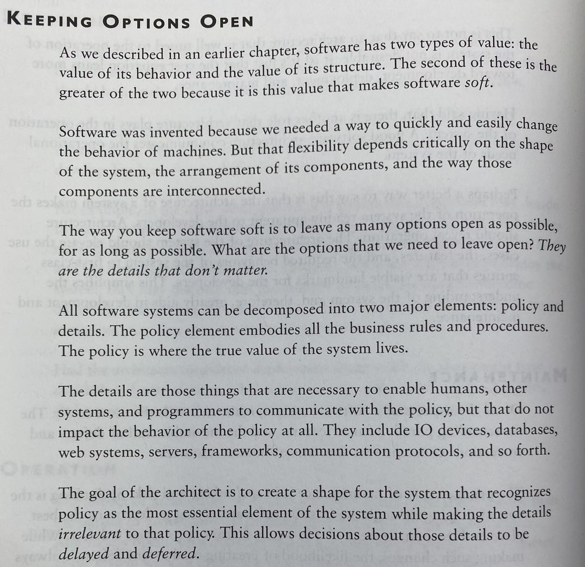
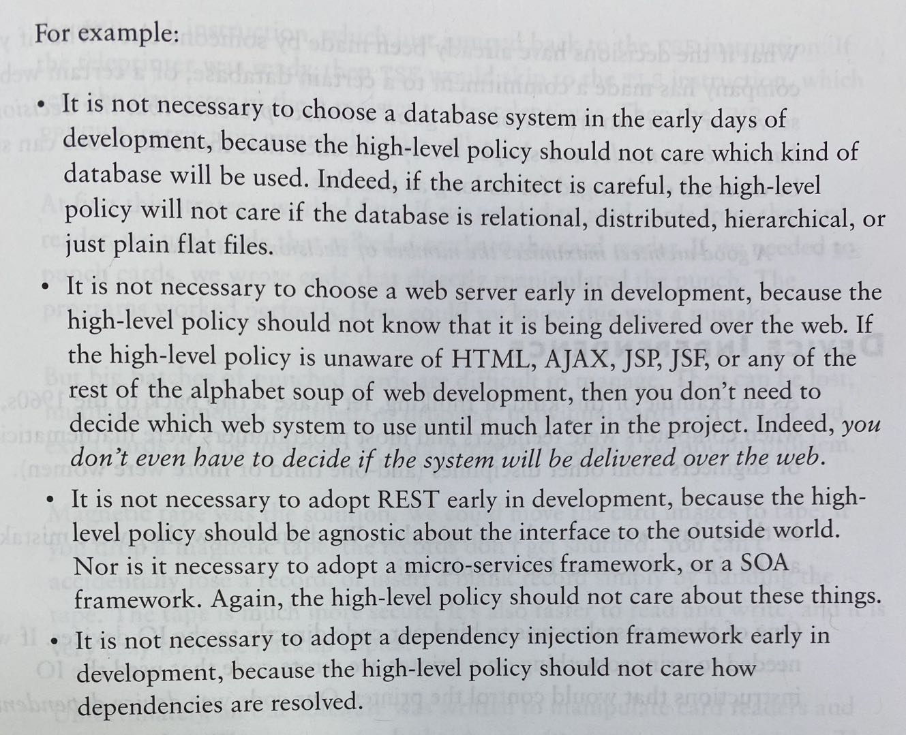

# Clean Architecture

## Chapter 1: Design & Architecture
### Goal
The goal of software architecture is to minimise the human resources required to build & maintain the required system.

### Metrics
- Lines of code over time
- Cost per line of code
- Productivity over time

## Chapter 2: A Tale of Two Values
### Behaviour vs Architecture

Consider importance & urgency matrix. In most cases, business logic (behaviour) is considered more urgent and architecture may never be urgent in the eyes or business managers.

Consider the extreme, new features can be easily added to a system with very good architecture. System with too many features, but poor architecture may end up becoming impossible for additional features to be added in.

## Chapter 3 - 6: Programming Paradigms

- Structured Programming: impose discipline on direct transfer of control
  - ability to create falsifiable units of programming
  - functional decomposition recursively breaks down a big problem to many small ones
  - Dijkstra, "tests show the presence, not the absence, of bugs". Software is like a science, which shows correctness by failing to prove incorrectness.
- OOP: impose discipline on indirect transfer of control
  - OO: combination of data & function
  - a way to model the real world
  - encapsulation (to expose only a subset of functions & data); inheritance (more conveniently play with data structure and reuse code); polymorphism: allows dependency inversion, which allows engineers to have absolute control over every source code dependency in the system
- Functional Programming: impose discipline upon assignment
  - **immutability:** no concurrency issue
  - **event sourcing:** store only the transactions, not the state. Instead of CRUD, just CR. Assuming unlimited storage and processing power, the system is entirely functional. (how source control system works)

Essentially: software is composed of sequence, selection, iteration, and indirection. Nothing more, nothing less.

## Chapter 7 - 11: Design Principles
#### Goal of the principle is to create mid-level software structures that:
- tolerate change
- easy to understand
- basis of components that can be used in many software systems

The famous SOLID Principles:


### SRP (The Single Responsibility Principle):
*A module (a cohesive set of functions & data structures) should be responsible to one, and only one, actor*

#### Common violations:
1. Accidental Duplication
Consider the following example:
```
Class Employee {
    calculatePay(); // specified by the accounting department
    reportHours(); // by HR
    save(); // by DBA
}
```
SRP suggests to separate the code that different actors depend on

2. Merges
separating the code prevents merge conflicts

Solution:
Create a EmployeeFacade class for lesser functions, with the purpose of delegating to classes with needed functions.
<br/>
1. 
2. 
3. 

### OCP: The Open-Closed Principle
*A software artifact should be open for extension but closed for modification*
- for example, simple extensions to the requirements should need simple engineering efforts

##### A system that displays financial summary on a web page, to be extended to print the same information on paper

- how component protects one another


- Directional Control: much complexity exists to make sure dependencies point to the right direction
- Information Hiding: ```FinancialReportRequester``` prevents ```FinancialReportController``` from knowing too much internals of the ```Interactor```
- No transitive dependencies: software entities should never depend on things they do not directly use

### LSP: The Liskov Substitution Principle
*If for each object o1 of type S there is an object o2 of type T such that for all programs P defined in terms of T, the behaviour of P is unchanged when o1 is substituted for o2 then S is a subtype of T.*

For example:


##### The Square/Rectangle Problem
- User to access Rectangle(+setH,+setW) extended by Square(+setSide)
- This violates LSP since user has to know whether a Rectangle is a Square

##### LSP & Architecture
- Earlier, LSP as a way to guide the use of inheritance
- Now, applicable to all interface related concepts

### ISP: The Interface Segregation Principle
- it is harmful to depend on modules that contain more than you need
- the following picture is the right way instead of having 3 users depending on OPS directly


### DIP: the Dependency Inversion Principle
*source code dependencies refer only to abstractions, not to concretions, as much as possible*
- __Stable abstractions:__ changes in implementations should not require changes in interface
  - do not refer to volatile concrete classes. use Abstract Factories
  - do not derive from volatile concrete classes
  - do not override concrete functions: make function abstract and create multiple implementations
  - never mention the name of anything concrete

- __Factories:__
  - creation of concrete objects require source code dependency on the concrete definition of that object
  - use _Abstract Factories_ to manage this kind of undesirable dependency
  
  - DIP violations cannot be entirely removed

## Chapter 12 Components
_Dynamically linked files which can be plugged together at runtime are the software components of our architecture_

## Chapter 13 Component Cohesion
- REP: The Reuse/Release Equivalence Principle
- CCP: The Common Closure Principle
- CRP: The Common Reuse Principle

### REP
_The granule of reuse is the granule of release_
- Classes & modules that are formed into a component must belong to a cohesive group, and should be releasable together
- The group should "make sense"

### The Common Closure Principle
_Gather into components those classes that change for the same reasons and at the same times._
_Separate into different components those classes that change at different times and for different reasons._
- Restatement of SRP, SRP: a class should not contain multiple reasons to change, CCP says a component should not have multiple reasons to change
- For most applications, maintainability > reusability
- When new requirement comes, good chance that change can be restricted to a minimal number of components

### The Common Reuse Principle
_Don't force users of a component to depend on things they don't need._
- focus on which classes should not be kept together in a component
- classes that are not tightly bound to each other should not be in the same component


### Tension for Component Cohesion
- CCP & REP are inclusive principles to make components larger
- CRP is an exclusive principle



Generally, projects tend to start on the right hand side of the triangle, where reusability is sacrificed, the as project matures, slide to left. It also varies from project to project.

## Chapter 14 Component Coupling
#### The Acyclic Dependencies Principle
_Allow no cycles in the component dependency graph_

##### Problem: code breaks the next morning after release

##### Solution:
1. The weekly build: developers focus on their private work, and integrate at the end of the week. This will not work as project scale grows.
2. Eliminating Dependency Cycles:
  - Partition the development environment into releasable components.
  - Release with a version number, then it is the duty of the client team to decide whether to use it.
  - During release process, individual components are released independently, verification from bottom up, e.g. components to be depended on will be tested first.
  - The most important thing is that there is no cyclic dependency - component graph has to be a DAG
  - Once there is a cycle, all components have to be released together

Example of A Dependency Cycle:


##### Breaking the Cycle
1. 
2. Add a new component that both depend on:


##### Top Down Design: isolation of volatility, components which change frequently should not affect other stable components
- Component dependency graph created to protect stable components
- Design structure grows & evolves with the logical design of the system
- If we tried to design the component dependency structure before any classes, it is likely to fail badly since we do not know much about common closure, reusable elements etc.

##### The Stable Dependency Principle
_Depend in the direction of stability_
- Any component that we expect to be volatile should not be depended on
- Generally, a component with lots of incoming dependencies is very stable
- Fan-in: incoming dependencies, Fan-out: outgoing dependencies; Instability: _I = Fan-out / (Fan-in + Fan-out)_
- In many cases, DI is a way to reverse the dependency, interface or abstract classes can be extremely stable

##### The Stable Abstraction Principle
_A component should be as abstract as it is stable_
- Relationship bet/w stability & abstractness
- a stable component should be abstract so that its stability does not prevent it from being extended
- an unstable component should be concrete since its instability allows the concrete code within it to be easily changed
- _A: Abstractness_: percentage of interfaces/abstract classes in a component to measure abstraction
- too abstract & stable: useless; too concrete & unstable: rigid (e.g. database schema, String class in Java - though String class rarely changes so it is ok)
- Try to have (A,I) as (0,1) or (1,0), though not possible in most cases

## Chapter 15: What is Architecture?
_Ultimate goal: minimize the lifetime cost of the system and to maximize programmer productivity_

___Architecture of a software system is the shape given to that system. The form of the shape is in the division of that system into components, the arrangement of those components, and the ways in which those components communicate with each other. And the strategy behind that facilitation is to leave as many options open as possible, for as long as possible___

#### Development
- small team tends to produce monolithic system with no well-defined architecture
- system developed by 5 teams may end up having 5 components
- both are not ideal

#### Deployment
- make a system that can be easily deployed with a single action
- consider the factor of deployment initially
- many micro-service architecture becomes difficult to maintain because of this

#### Operation
- A good software architecture communicates the operational needs of the system (e.g. database maintenance, adding servers etc.)
- Certain examples include: stateless vs stateful login

#### Maintenance
- Mitigate the cost of troubleshooting & fixing bugs etc.
- Cost to figure out a bug should be low
- Cost to fix a bug should be low, and no additional defects should come out of it

#### Keeping Options Open


