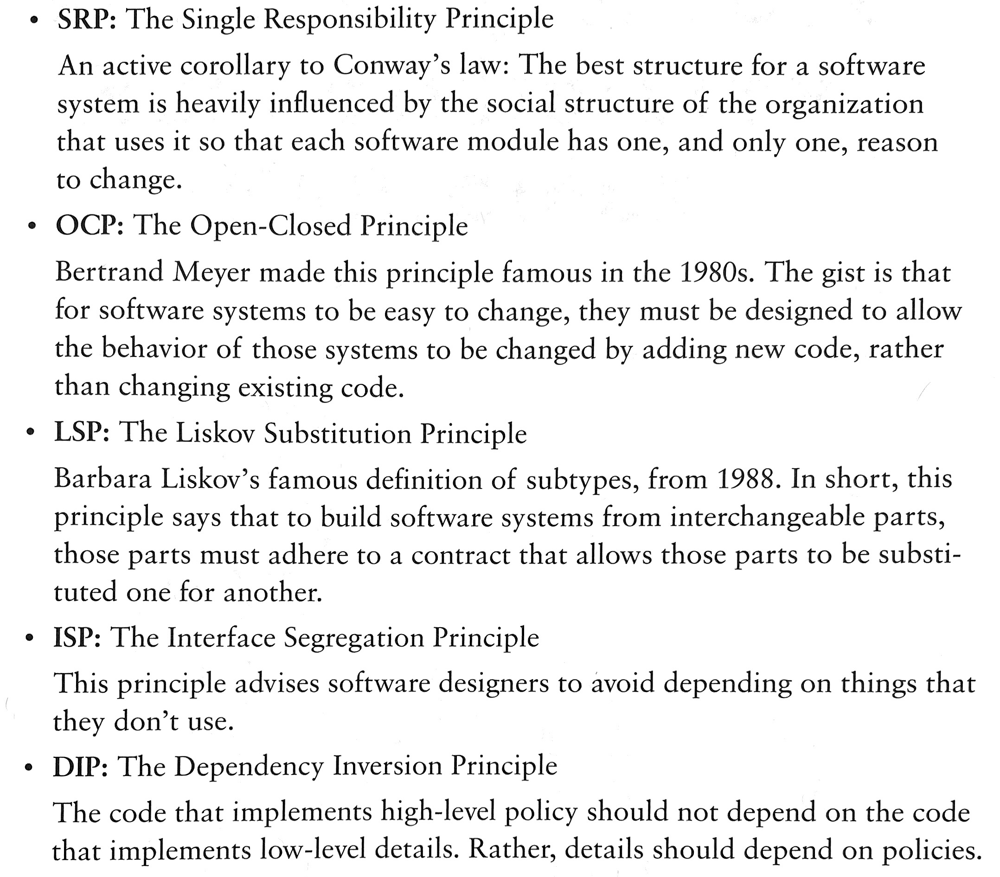
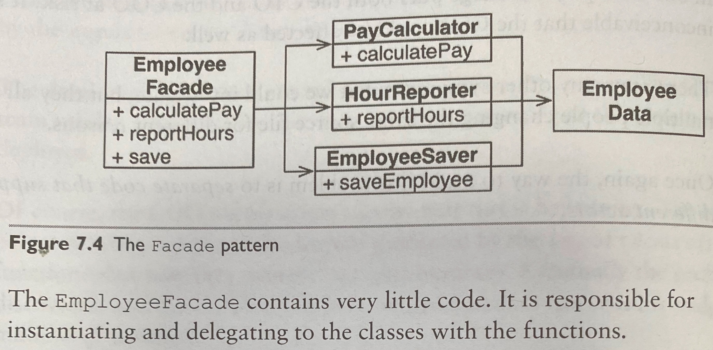
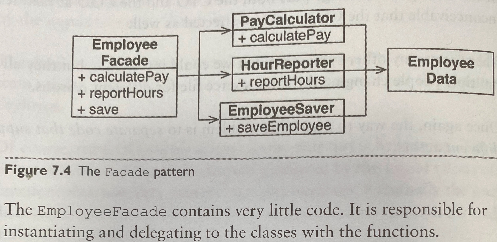
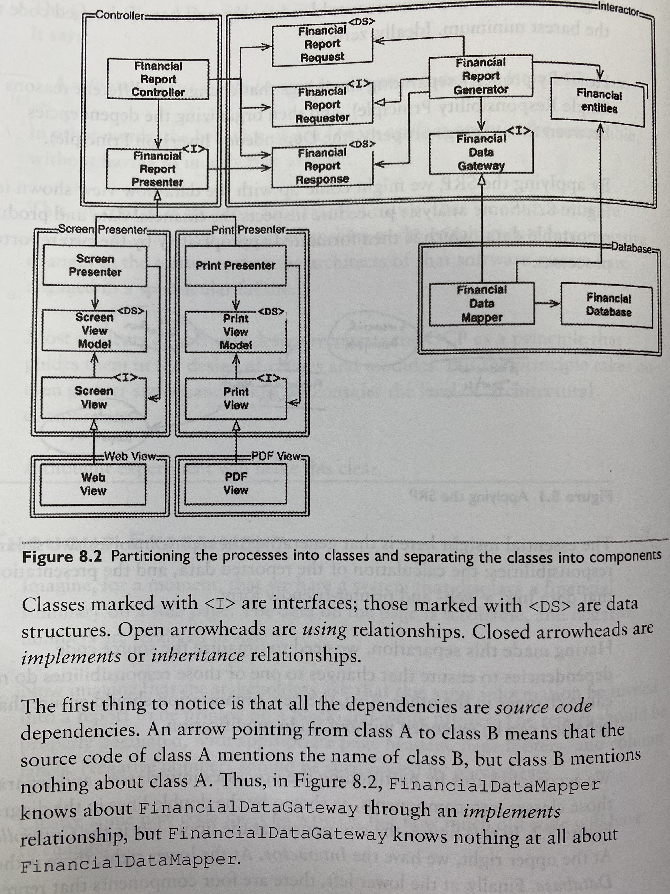
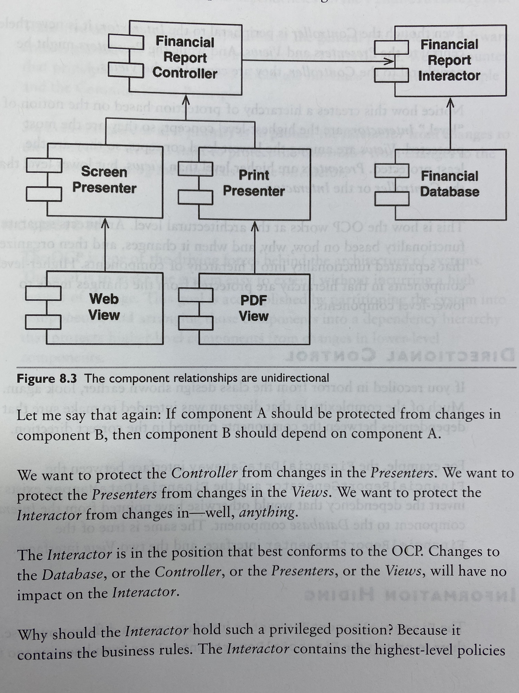

# Clean Architecture

## Chapter 1: Design & Architecture
### Goal
The goal of software architecture is to minimise the human resources required to build & maintain the required system.

### Metrics
- Lines of code over time
- Cost per line of code
- Productivity over time

## Chapter 2: A Tale of Two Values
### Behaviour vs Architecture

Consider importance & urgency matrix. In most cases, business logic (behaviour) is considered more urgent and architecture may never be urgent in the eyes or business managers.

Consider the extreme, new features can be easily added to a system with very good architecture. System with too many features, but poor architecture may end up becoming impossible for additional features to be added in.

## Chapter 3 - 6: Programming Paradigms

- Structured Programming: impose discipline on direct transfer of control
  - ability to create falsifiable units of programming
  - functional decomposition recursively breaks down a big problem to many small ones
  - Dijkstra, "tests show the presence, not the absence, of bugs". Software is like a science, which shows correctness by failing to prove incorrectness.
- OOP: impose discipline on indirect transfer of control
  - OO: combination of data & function
  - a way to model the real world
  - encapsulation (to expose only a subset of functions & data); inheritance (more conveniently play with data structure and reuse code); polymorphism: allows dependency inversion, which allows engineers to have absolute control over every source code dependency in the system
- Functional Programming: impose discipline upon assignment
  - **immutability:** no concurrency issue
  - **event sourcing:** store only the transactions, not the state. Instead of CRUD, just CR. Assuming unlimited storage and processing power, the system is entirely functional. (how source control system works)

Essentially: software is composed of sequence, selection, iteration, and indirection. Nothing more, nothing less.

## Chapter 7 - 11: Design Principles
#### Goal of the principle is to create mid-level software structures that:
- tolerate change
- easy to understand
- basis of components that can be used in many software systems

The famous SOLID Principles:


### SRP (The Single Responsibility Principle):
*A module (a cohesive set of functions & data structures) should be responsible to one, and only one, actor*

#### Common violations:
1. Accidental Duplication
Consider the following example:
```
Class Employee {
    calculatePay(); // specified by the accounting department
    reportHours(); // by HR
    save(); // by DBA
}
```
SRP suggests to separate the code that different actors depend on

2. Merges
separating the code prevents merge conflicts

Solution:
Create a EmployeeFacade class for lesser functions, with the purpose of delegating to classes with needed functions.
<br/>
1. 
2. 
3. 

### OCP: The Open-Closed Principle
*A software artifact should be open for extension but closed for modification*
- for example, simple extensions to the requirements should need simple engineering efforts

##### A system that displays financial summary on a web page, to be extended to print the same information on paper

- how component protects one another


- Directional Control: much complexity exists to make sure dependencies point to the right direction
- Information Hiding: ```FinancialReportRequester``` prevents ```FinancialReportController``` from knowing too much internals of the ```Interactor```
- No transitive dependencies: software entities should never depend on things they do not directly use

### LSP: The Liskov Substitution Principle
